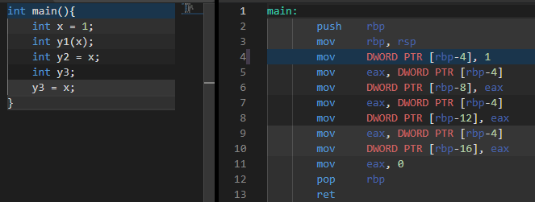

복사 생성과 대입 생성의 결과인데
이 코드의 어셈블리어는 모두 같다.




클래스 타입도 똑같다. 한쪽의 메모리 영역에서 다른쪽 메모리의 영역에 복사

클래스는 숨겨진 코드가 실행된다는 차이가 있다

그래서 이제 보이지 않는 복사 생성자와 복사 대입 연산자에 대해 파악한다.


명시적 복사 생성자의 경우 부모나 맴버 클래스의 기본 생성자 호출

암시적 복사 생성자의 경우 부모나 맴버 클래스의 복사 생성자 호출하면서 얕은 복사를 수행

```c++
CTest t1(t0);
CTest t1 = t0;
void foo(CTest t){}
void foo(const CTest& t){}
// 참조에 의한 호출로 원본 객체를 보호한다.
// 이 둘은 오버로딩 불가
```

이 암시적인 동작 때문에 `explict` 키워드가 있으니 따로 알아볼 필요있음